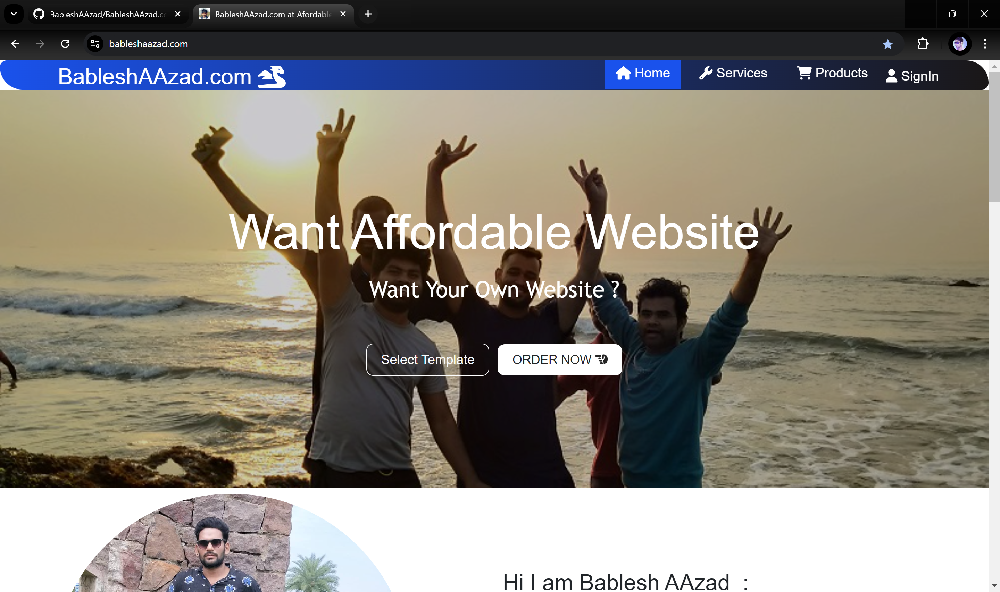
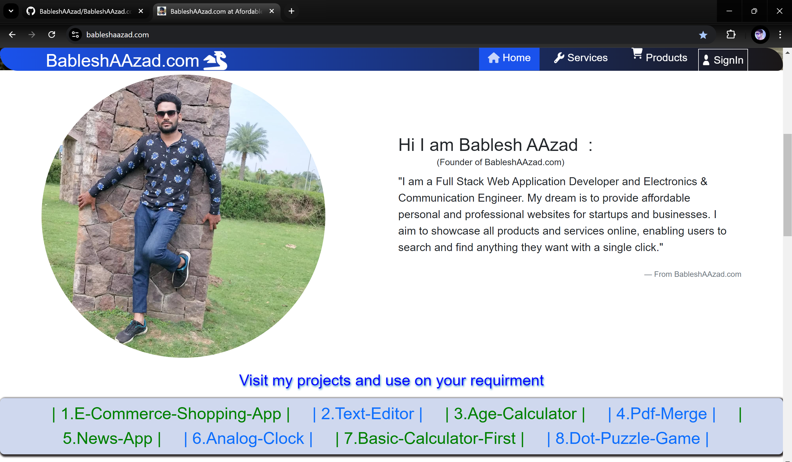
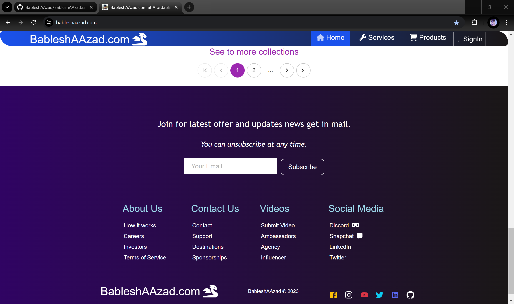

## 😁[BableshAAzad.com](https://www.bableshaazad.com)
- This is static blogging website based on reactjs.
- There i am mention my Blogges and mini reactjs projects.

---

**🧑‍💻 Technologies Used:**

`Reactjs` `React-Router-Dome` `Material-UI` `Bootstrap5` `JavaScript` `CSS3` `HTML5`

---

#### 📝 Examples UI

#### 🏚️ Home page 🛬

  

  

#### 🚗🧑 Footer page 📱

  

